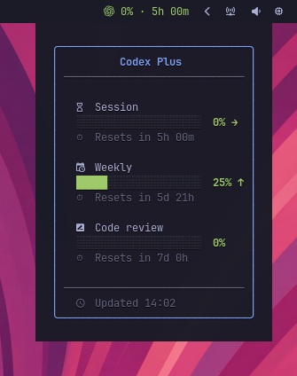
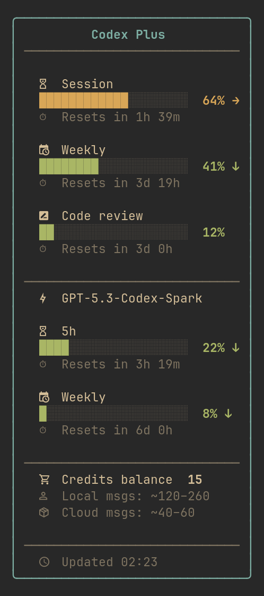
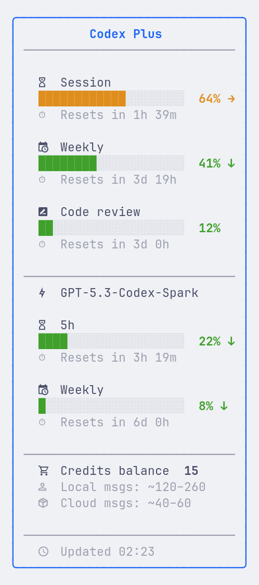

# codexbar

[](https://aur.archlinux.org/packages/codexbar)
[](LICENSE)

Waybar widget that displays your OpenAI Codex subscription usage — session (5h) limit, weekly limit, code review limit, and credits — with colored progress bars and countdown timers.


## Features

- Session (5h) and weekly usage with progress bars
- Code review usage tracking
- Credits balance display
- Pacing indicators — ratio-based and point-based, with optional per-window coloring
- Tooltip elapsed markers — visual pacing reference in progress bars
- Colored severity levels (green → yellow → orange → red)
- Rich Pango tooltip with box-drawing borders
- Token auto-refresh with background sync
- Response cache (60s TTL) — fast even on multi-monitor setups
- Graceful fallback on network errors
- Pure Bash — no runtime dependencies beyond `curl`, `jq`, GNU `date`, and `base64`
- Works with any Waybar setup (Hyprland, Sway, etc.)

## Requirements

- [Codex CLI](https://github.com/openai/codex) — must be logged in (`codex login`)
- `curl`, `jq`, GNU `date`, `base64` (standard on most Linux distros)
- [Waybar](https://github.com/Alexays/Waybar)
- A [Nerd Font](https://www.nerdfonts.com/) for tooltip icons
- (Optional) [Font Awesome](https://fontawesome.com/) ≥ 7.0.0 OTF for the OpenAI brand icon

## Installation

### Arch Linux (AUR)

```bash
yay -S codexbar
```

### From source

```bash
git clone https://github.com/mryll/codexbar.git
cd codexbar
make install PREFIX=~/.local
```

Or system-wide:

```bash
sudo make install
```

To uninstall:

```bash
make uninstall PREFIX=~/.local
```

### Quick install

```bash
curl -fsSL https://raw.githubusercontent.com/mryll/codexbar/master/codexbar \
  -o ~/.local/bin/codexbar && chmod +x ~/.local/bin/codexbar
```

## Quick start

Add the module to your `~/.config/waybar/config.jsonc`:

```jsonc
"modules-right": ["custom/codexbar", ...],

"custom/codexbar": {
    "exec": "codexbar",
    "return-type": "json",
    "interval": 300,
    "signal": 12,
    "tooltip": true,
    "on-click": "xdg-open https://chatgpt.com/codex/settings/usage"
}
```

## Configuration

### Icon

Use `--icon` to prepend an icon to the widget text. The icon inherits the same color as the usage text.

**Emoji:**

```jsonc
"exec": "codexbar --icon '🤖'"
// => 🤖 42% · 1h 30m
```

**Nerd Font glyph:**

```jsonc
"exec": "codexbar --icon '󰚩'"
// => 󰚩 42% · 1h 30m
```

**OpenAI brand icon** (requires [Font Awesome](https://fontawesome.com/) ≥ 7.0.0 OTF):

```jsonc
"exec": "codexbar --icon \"<span font='Font Awesome 7 Brands'>&#xe7cf;</span>\""
```

> [!NOTE]
> On Arch Linux, install the OTF package (`sudo pacman -S otf-font-awesome`). The WOFF2 variant (`woff2-font-awesome`) does not render in Waybar due to a [Pango compatibility issue](https://github.com/Alexays/Waybar/issues/4381).

### Colors

The bar text is colored by severity level out of the box (One Dark palette):

| Class | Range | Default color |
|---|---|---|
| `low` | 0–49% | `#98c379` (green) |
| `mid` | 50–74% | `#e5c07b` (yellow) |
| `high` | 75–89% | `#d19a66` (orange) |
| `critical` | 90–100% | `#e06c75` (red) |

To override, pass `--color-*` flags in the `exec` field:

```jsonc
"custom/codexbar": {
    "exec": "codexbar --color-low '#50fa7b' --color-critical '#ff5555'",
    ...
}
```

Available flags: `--color-low`, `--color-mid`, `--color-high`, `--color-critical`.

CSS classes (`low`, `mid`, `high`, `critical`) are also emitted for additional styling via `~/.config/waybar/style.css`.

### Theming (Omarchy)

Tooltip and bar text colors are automatically read from the active [Omarchy](https://github.com/basecamp/omarchy) theme at `~/.config/omarchy/current/theme/colors.toml` on every execution. On non-Omarchy systems, the One Dark palette is used as fallback.

The priority chain is: **CLI flags** (`--color-*`) > **Omarchy theme** > **One Dark defaults**.

| Tokyo Night | Gruvbox | Catppuccin Latte |
|:---:|:---:|:---:|
|  |  |  |

### Format customization

Use `--format` to control the bar text:

```bash
# Default (session usage + countdown)
codexbar
# => 42% · 1h 30m

# Session + weekly
codexbar --format '{session_pct}% · {weekly_pct}%'
# => 42% · 27%

# With pacing indicator
codexbar --format '{session_pct}% {session_pace} · {session_reset}'
# => 42% ↑ · 1h 30m

# Minimal
codexbar --format '{session_pct}%'
# => 42%
```

Use `--tooltip-format` for a custom plain-text tooltip (overrides the default rich tooltip):

```bash
codexbar --tooltip-format 'Session: {session_pct}% | Weekly: {weekly_pct}%'
```

Example Waybar config with custom format:

```jsonc
"custom/codexbar": {
    "exec": "codexbar --format '{session_pct}% {session_pace}'",
    "return-type": "json",
    "interval": 300,
    "signal": 12,
    "tooltip": true,
    "on-click": "xdg-open https://chatgpt.com/codex/settings/usage"
}
```

#### Available placeholders

| Placeholder | Description | Example |
|---|---|---|
| `{plan}` | Plan label | `Plus` |
| `{session_pct}` | Session (5h) usage % | `42` |
| `{session_reset}` | Session countdown | `1h 30m` |
| `{session_elapsed}` | Session time elapsed % | `58` |
| `{session_bar}` | Session usage progress bar (Pango) | `████████░░░░░░░░░░░░` |
| `{session_pace}` | Session pacing icon (ratio-based) | `↑` / `↓` / `→` |
| `{session_pace_indicator}` | Session pacing icon (point-based) | `↑` / `↓` / `→` |
| `{session_pace_pct}` | Session pacing deviation (ratio) | `12% ahead` |
| `{session_pace_pts}` | Session pacing deviation (points) | `5pts ahead` |
| `{session_pace_delta}` | Session pacing delta (signed) | `-12` |
| `{session_pace_abs_delta}` | Session pacing delta (unsigned) | `12` |
| `{weekly_pct}` | Weekly usage % | `27` |
| `{weekly_reset}` | Weekly countdown | `4d 1h` |
| `{weekly_elapsed}` | Weekly elapsed % | `42` |
| `{weekly_bar}` | Weekly usage progress bar (Pango) | `█████░░░░░░░░░░░░░░░` |
| `{weekly_pace}` | Weekly pacing icon (ratio-based) | `↑` / `↓` / `→` |
| `{weekly_pace_indicator}` | Weekly pacing icon (point-based) | `↑` / `↓` / `→` |
| `{weekly_pace_pct}` | Weekly pacing deviation (ratio) | `5% under` |
| `{weekly_pace_pts}` | Weekly pacing deviation (points) | `8pts under` |
| `{weekly_pace_delta}` | Weekly pacing delta (signed) | `-8` |
| `{weekly_pace_abs_delta}` | Weekly pacing delta (unsigned) | `8` |
| `{review_pct}` | Code review usage % | `4` |
| `{review_reset}` | Code review countdown | `6d 23h` |
| `{review_elapsed}` | Code review time elapsed % | `42` |
| `{review_bar}` | Code review usage progress bar (Pango) | `░░░░░░░░░░░░░░░░░░░░` |
| `{review_pace}` | Code review pacing icon (ratio-based) | `↑` / `↓` / `→` |
| `{review_pace_indicator}` | Code review pacing icon (point-based) | `↑` / `↓` / `→` |
| `{review_pace_pct}` | Code review pacing deviation (ratio) | `3% ahead` |
| `{review_pace_pts}` | Code review pacing deviation (points) | `3pts ahead` |
| `{review_pace_delta}` | Code review pacing delta (signed) | `3` |
| `{review_pace_abs_delta}` | Code review pacing delta (unsigned) | `3` |
| `{credits_balance}` | Credits balance | `0` |
| `{credits_local}` | Approx local messages | `10–15` |
| `{credits_cloud}` | Approx cloud messages | `5–8` |

> [!NOTE]
> Bar placeholders are colored by their own window's usage thresholds (low/mid/high/critical), independently of the surrounding bar text color, which reflects the worst window overall. A `{session_bar}` can render green while the surrounding text is red because weekly or review hit the critical threshold.

### Pacing indicators

Pacing compares your actual usage against where you "should" be if you spread your quota evenly across the window. It answers: "at this rate, will I run out before the window resets?"

- **↑** — ahead of pace (using faster than sustainable)
- **→** — on track
- **↓** — under pace (plenty of room left)

**How it works:** if 30% of the session time has elapsed, you "should" have used ~30% of your quota. The widget divides your actual usage by the expected usage and flags deviations beyond a tolerance band:

| Scenario | Time elapsed | Usage | Pacing | Icon |
|---|---|---|---|---|
| Burning through quota | 25% | 60% | 140% ahead | ↑ |
| Slightly ahead | 50% | 52% | on track (within tolerance) | → |
| Perfectly even | 50% | 50% | on track | → |
| Conserving | 70% | 30% | 57% under | ↓ |

By default the tolerance is **±5%** — deviations of 5% or less show as "on track" to avoid noise. You can tune it with `--pace-tolerance`:

```bash
# More sensitive (±2%) — flags smaller deviations
codexbar --pace-tolerance 2

# More relaxed (±10%) — only flags large deviations
codexbar --pace-tolerance 10
```

The `{session_pace_pct}` / `{weekly_pace_pct}` placeholders show the deviation (e.g. "12% ahead", "5% under", "on track").

#### Point-based pacing

In addition to ratio-based pacing, there's a point-based alternative that computes `actual_usage - expected_usage`. At 22% usage with 78% elapsed, the delta is -56 -- intuitive and stable across the window.

| Placeholder | Type | Example | Description |
|---|---|---|---|
| `{*_pace}` | Ratio | ↑ | Icon with tolerance band (±5% default) |
| `{*_pace_indicator}` | Points | ↑ | Icon without tolerance (any non-zero = ↑/↓) |
| `{*_pace_pct}` | Ratio | 12% ahead | Ratio-based deviation label |
| `{*_pace_pts}` | Points | 5pts ahead | Point-based deviation label |
| `{*_pace_delta}` | Points | -12 | Signed integer delta |
| `{*_pace_abs_delta}` | Points | 12 | Unsigned integer delta |

Replace `*` with `session`, `weekly`, or `review`.

### Per-window pace coloring

Use `--format-pace-color` to color pace placeholders individually per window based on their point delta, instead of the global usage-based color:

```bash
codexbar --format-pace-color \
  --format '{session_pace_indicator}{session_pace_abs_delta}·{weekly_pace_indicator}{weekly_pace_abs_delta}'
# => ↑4·↓10  (↑4 in orange, ↓10 in green, · in neutral)
```

| Delta | Color | Meaning |
|---|---|---|
| ≤ -10 | Green | Well under pace |
| -10 to 0 | Yellow | Slightly under or on pace |
| 1 to 9 | Orange | Slightly ahead |
| ≥ 10 | Red | Burning fast |

Without this flag, the entire bar text is colored by usage percentage -- identical to the default behavior.

### Tooltip elapsed markers

Use `--tooltip-pace-pts` to add an elapsed marker to each tooltip progress bar, showing where even pacing would put you:

```
Without --tooltip-pace-pts:
  Session
    ░░░░░░░░░░░░░░░░░░░░  27% ↑

With --tooltip-pace-pts:
  Session
    ░░░░░░░░░░█░░░░░░░░░  27% ↑
                  ^ marker at 32% (even pace position)
```

The marker color adapts to the active theme. Without this flag, the tooltip is unchanged.

### Spacing

Adjust `padding` (inside the widget) and `margin` (outside the widget) in `~/.config/waybar/style.css`:

```css
#custom-codexbar {
    padding: 0 8px;
    margin: 0 4px;
}
```

## How it works

1. Reads OAuth tokens from `~/.codex/auth.json` (created by `codex login`)
2. Auto-refreshes expired tokens via OpenAI's OAuth endpoint
3. Fetches usage data from the ChatGPT backend API
4. Caches responses for 60 seconds
5. Outputs JSON for Waybar: `{text, tooltip, class}`

## Troubleshooting

| Bar shows | Meaning | Fix |
|---|---|---|
| `↻` | Syncing | Normal at boot — data appears on next refresh |
| `⚠` | Auth error | Run `codex login` to authenticate |
| `⚠` | Token expired | Run `codex login` to re-authenticate |
| `⚠` | API error | Check your internet connection |
| Nothing | Module not loaded | Check Waybar config and restart Waybar |

## Related

- [claudebar](https://github.com/mryll/claudebar) — Claude AI usage widget for Waybar
- [logibar](https://github.com/mryll/logibar) — Logitech battery widgets for Waybar
- [meteobar](https://github.com/mryll/meteobar) — Weather widget for Waybar (Open-Meteo)
- [Omarchy](https://github.com/basecamp/omarchy) — Beautiful, modern & opinionated Linux distribution
- [Waybar](https://github.com/Alexays/Waybar) — Status bar for Wayland compositors
