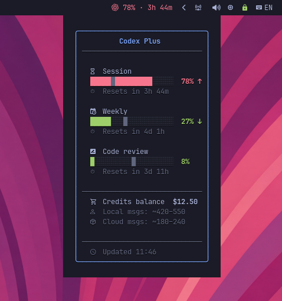

# codexbar

Waybar widget that displays your OpenAI Codex subscription usage — session (5h) limit, weekly limit, code review limit, and credits — with colored progress bars and countdown timers.



## Features

- Session (5h) and weekly usage with progress bars
- Code review usage tracking
- Credits balance display
- Pacing indicators (ahead/under/on track)
- Colored severity levels (green → yellow → orange → red)
- Rich Pango tooltip with box-drawing borders
- Token auto-refresh with background sync
- 60s cache to reduce API calls
- Graceful fallback on network errors

## Prerequisites

- [Codex CLI](https://github.com/openai/codex) (`codex login` for authentication)
- `curl`, `jq`, GNU `date`, `base64` (standard on most Linux distros)
- A [Nerd Font](https://www.nerdfonts.com/) for tooltip icons
- [Waybar](https://github.com/Alexays/Waybar)
- (Optional) [Font Awesome](https://fontawesome.com/) ≥ 7.0.0 OTF for the OpenAI brand icon

## Install

### Arch Linux (AUR)

```bash
yay -S codexbar
```

### From source

```bash
# User-local
make install PREFIX=~/.local

# System-wide
sudo make install

# Or just copy
cp codexbar ~/.local/bin/
chmod +x ~/.local/bin/codexbar
```

## Waybar Configuration

Add to your Waybar config:

```jsonc
"modules-right": ["custom/codexbar", ...],

// Without icon (default)
"custom/codexbar": {
    "exec": "codexbar",
    "return-type": "json",
    "interval": 60,
    "tooltip": true,
    "on-click": "xdg-open https://chatgpt.com/codex/settings/usage"
}
```

### Adding an icon

You can add any icon via waybar's `format` field. The `{}` placeholder is replaced with the widget text.

**No icon** (default):

```jsonc
"custom/codexbar": {
    "exec": "codexbar",
    "return-type": "json",
    "interval": 60,
    "tooltip": true,
    "on-click": "xdg-open https://chatgpt.com/codex/settings/usage"
}
// => 42% · 1h 30m
```

**Nerd Font icon** (any Nerd Font glyph):

```jsonc
"custom/codexbar": {
    "exec": "codexbar",
    "format": " {}",
    "return-type": "json",
    "interval": 60,
    "tooltip": true,
    "on-click": "xdg-open https://chatgpt.com/codex/settings/usage"
}
// =>  42% · 1h 30m
```

**OpenAI brand icon** (requires [Font Awesome](https://fontawesome.com/) ≥ 7.0.0 OTF):

```jsonc
"custom/codexbar": {
    "exec": "codexbar",
    "format": "<span font='Font Awesome 7 Brands'>\ue7cf</span> {}",
    "return-type": "json",
    "interval": 60,
    "tooltip": true,
    "on-click": "xdg-open https://chatgpt.com/codex/settings/usage"
}
```

> **Note:** On Arch Linux, install the OTF package (`sudo pacman -S otf-font-awesome`).
> The WOFF2 variant (`woff2-font-awesome`) does not render in Waybar due to a
> [Pango compatibility issue](https://github.com/Alexays/Waybar/issues/4381).

### Colors

The bar text is colored by severity level out of the box (One Dark palette):

| Class | Range | Default color |
|---|---|---|
| `low` | 0-49% | `#98c379` (green) |
| `mid` | 50-74% | `#e5c07b` (yellow) |
| `high` | 75-89% | `#d19a66` (orange) |
| `critical` | 90-100% | `#e06c75` (red) |

To override, pass `--color-*` flags in the `exec` field:

```jsonc
"custom/codexbar": {
    "exec": "codexbar --color-low '#50fa7b' --color-critical '#ff5555'",
    ...
}
```

Available flags: `--color-low`, `--color-mid`, `--color-high`, `--color-critical`.

CSS classes (`low`, `mid`, `high`, `critical`) are also emitted for additional styling via `~/.config/waybar/style.css`.

## Custom Formats

```bash
# Bar text format
codexbar --format '{session_pct}% · {weekly_pct}%'

# Tooltip format (plain text, replaces Pango tooltip)
codexbar --tooltip-format 'Session: {session_pct}% | Weekly: {weekly_pct}%'
```

### Available Placeholders

| Placeholder | Description | Example |
|---|---|---|
| `{plan}` | Plan label | `Plus` |
| `{session_pct}` | Session (5h) usage % | `42` |
| `{session_reset}` | Session countdown | `1h 30m` |
| `{session_elapsed}` | Session time elapsed % | `58` |
| `{session_pace}` | Pacing icon | `↑` / `↓` / `→` |
| `{session_pace_pct}` | Pacing deviation | `12% ahead` |
| `{weekly_pct}` | Weekly usage % | `27` |
| `{weekly_reset}` | Weekly countdown | `4d 1h` |
| `{weekly_elapsed}` | Weekly elapsed % | `42` |
| `{weekly_pace}` | Pacing icon | `↑` / `↓` / `→` |
| `{weekly_pace_pct}` | Pacing deviation | `5% under` |
| `{review_pct}` | Code review usage % | `4` |
| `{review_reset}` | Code review countdown | `6d 23h` |
| `{credits_balance}` | Credits balance | `0` |
| `{credits_local}` | Approx local messages | `10–15` |
| `{credits_cloud}` | Approx cloud messages | `5–8` |

### Pacing indicators

Pacing compares your actual usage against where you "should" be if you spread your quota evenly across the window. It answers: "at this rate, will I run out before the window resets?"

- **↑** -- ahead of pace (using faster than sustainable)
- **→** -- on track
- **↓** -- under pace (plenty of room left)

**How it works:** if 30% of the session time has elapsed, you "should" have used ~30% of your quota. The widget divides your actual usage by the expected usage and flags deviations beyond a tolerance band:

| Scenario | Time elapsed | Usage | Pacing | Icon |
|---|---|---|---|---|
| Burning through quota | 25% | 60% | 140% ahead | ↑ |
| Slightly ahead | 50% | 52% | on track (within tolerance) | → |
| Perfectly even | 50% | 50% | on track | → |
| Conserving | 70% | 30% | 57% under | ↓ |

By default the tolerance is **±5%** -- deviations of 5% or less show as "on track" to avoid noise. `--pace-tolerance` accepts a non-negative integer (e.g. 0–50). You can tune it like this:

```bash
# More sensitive (±2%) -- flags smaller deviations
codexbar --pace-tolerance 2

# More relaxed (±10%) -- only flags large deviations
codexbar --pace-tolerance 10

# Default (±5%)
codexbar
```

In your waybar config:

```jsonc
"custom/codexbar": {
    "exec": "codexbar --pace-tolerance 3",
    "return-type": "json",
    "interval": 60,
    "tooltip": true
}
```

## How It Works

1. Reads OAuth tokens from `~/.codex/auth.json` (created by `codex login`)
2. Auto-refreshes expired tokens via OpenAI's OAuth endpoint
3. Fetches usage data from the ChatGPT backend API
4. Caches responses for 60 seconds
5. Outputs JSON for Waybar: `{text, tooltip, class}`

## License

MIT
