# codexbar

[](https://aur.archlinux.org/packages/codexbar)
[](LICENSE)

codexbar shows your use of the OpenAI Codex subscription in [Waybar](https://github.com/Alexays/Waybar) and in the [Omarchy](https://omarchy.org) shell. It reads every limit that the Codex API reports. These limits are the session (5h) window, the weekly window, code review, the per-model meters, and the credits balance. It also gives you a warning before a limit stops your work.

The same core drives both frontends, so a number reads the same on either one:

| The Omarchy shell plugin | The Waybar module |
| :---: | :---: |
| 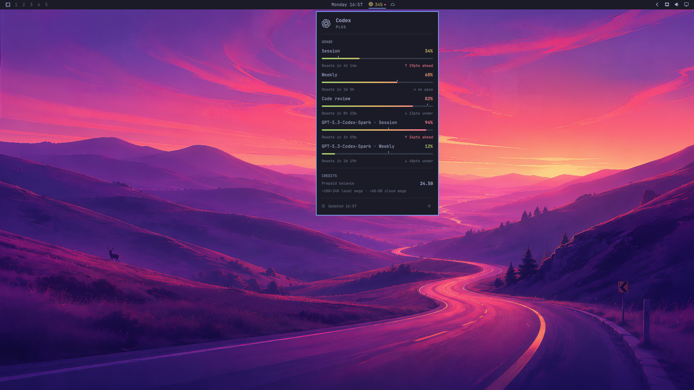 | 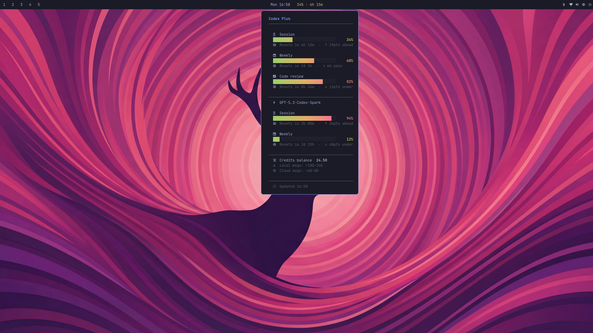 |

## Contents

- [Features](#features)
- [Requirements](#requirements)
- [Installation](#installation)
- [Quick start](#quick-start)
- [Configuration](#configuration)
- [Omarchy shell plugin](#omarchy-shell-plugin)
- [Theming](#theming)
- [Tooltip font](#tooltip-font)
- [Monochrome mode](#monochrome-mode)
- [Structured JSON output](#structured-json-output)
- [How it works](#how-it-works)
- [Troubleshooting](#troubleshooting)
- [Related](#related)

## Features

- Every limit that the API reports: session (5h), weekly, code review, per-model meters, and credits
- A color gauge from green to red. The color of a value is always the same, so you can read it quickly
- Pace indicators that compare your use with the elapsed time, so you know if your use is too fast
- An alarm dot when a limit that you do not see on the bar is almost full
- codexbar follows your Omarchy theme, or your pywal colors
- Monochrome mode, for a bar without color
- Structured JSON output for your own scripts
- Token refresh in the background, and a 60-second cache, so many monitors stay fast
- Pure Bash. It needs only `curl`, `jq`, GNU `date`, and `base64`

## Requirements

- [Codex CLI](https://github.com/openai/codex), with a login (`codex login`)
- `curl`, `jq`, GNU `date`, and `base64`
- [Waybar](https://github.com/Alexays/Waybar), or the Omarchy shell
- A [Nerd Font](https://www.nerdfonts.com/), for the icons in the tooltip
- Optional: [Font Awesome](https://fontawesome.com/) 7.0.0 or later (OTF), for the OpenAI icon

## Installation

### Omarchy

On [Omarchy](https://omarchy.org), the complete installation is two commands:

```bash
yay -S codexbar
omarchy plugin add https://github.com/mryll/codexbar.git --enable
```

The first command installs the CLI. The second command installs the bar widget and enables it. Refer to [Omarchy shell plugin](#omarchy-shell-plugin) for the panel and its settings.

### Arch Linux (AUR)

```bash
yay -S codexbar
```

### From source

```bash
git clone https://github.com/mryll/codexbar.git
cd codexbar
make install PREFIX=~/.local
```

To install codexbar for all users, use `sudo make install`. To remove codexbar, use `make uninstall PREFIX=~/.local`.

### One file

```bash
curl -fsSL https://raw.githubusercontent.com/mryll/codexbar/master/codexbar \
  -o ~/.local/bin/codexbar && chmod +x ~/.local/bin/codexbar
```

<p align="center">
  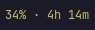
</p>

## Quick start

Add the module to `~/.config/waybar/config.jsonc`:

```jsonc
"modules-right": ["custom/codexbar", ...],

"custom/codexbar": {
    "exec": "codexbar",
    "return-type": "json",
    "interval": 300,
    "signal": 12,
    "tooltip": true,
    "on-click": "xdg-open https://chatgpt.com/codex/settings/usage"
}
```

Run `codexbar --help` for the full reference: the usage line, every flag, and the format placeholders.

The bar shows your session use and the time until the reset. Put the pointer on the module to see all of your limits:

<p align="center">
  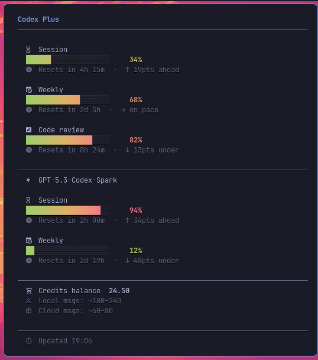
</p>

## Configuration

| Flag | What it does |
|---|---|
| `--help` | Prints the reference — usage, every flag, and the format placeholders — and exits 0. Also `-h` |
| `--icon ICON` | Puts an icon before the text |
| `--format FORMAT` | Sets the bar text. Default: `{session_pct}% · {session_reset}` |
| `--tooltip-format FORMAT` | Replaces the tooltip with your own text |
| `--remaining` | Counts what is left, not what is used |
| `--pace-tolerance N` | Sets the difference from the pace that is still "on pace". Default: `5` |
| `--format-pace-color` | Gives the pace indicator its own color in the bar |
| `--tooltip-pace-pts` | Uses point-based pace in the tooltip, and adds a pace mark to each bar |
| `--tooltip-font FONT` | Font family (or Pango family list) the tooltip is pinned to. Default: `JetBrainsMono Nerd Font Mono, JetBrainsMono Nerd Font, monospace`. It must be monospace — see [Tooltip font](#tooltip-font) |
| `--frame`, `--frame-font` | **DEPRECATED**, still accepted so an existing config keeps working. `--frame` drew a bordered card around the tooltip and is now a no-op; `--frame-font` is an alias for `--tooltip-font` |
| `--color-low HEX` | Sets the color for 0–49% |
| `--color-mid HEX` | Sets the color for 50–74% |
| `--color-high HEX` | Sets the color for 75–89% |
| `--color-critical HEX` | Sets the color for 90–100% |
| `--no-color[=WHAT]` | Removes the color. See [Monochrome mode](#monochrome-mode) |
| `--json` | Prints structured data. See [Structured JSON output](#structured-json-output) |
| `--refresh` | Ignores the cache and gets new data now |

### Format placeholders

Use these placeholders in `--format` and `--tooltip-format`. Replace `session` with `weekly` or `review` for the other windows.

| Placeholder | Shows |
|---|---|
| `{icon}` | The widget mark, in the Nerd Font: `󱙺` |
| `{plan}` | The plan name, for example `Plus` |
| `{session_pct}` | The use, in percent |
| `{session_remaining_pct}` | What is left, in percent |
| `{session_reset}` | The time until the reset, for example `1h 30m` |
| `{session_elapsed}` | The elapsed part of the window, in percent |
| `{session_bar}` | A progress bar |
| `{session_remaining_bar}` | A progress bar of what is left |
| `{session_pace}` | The pace icon, from the ratio: `↑` `↓` `→` |
| `{session_pace_indicator}` | The pace icon, from the points |
| `{session_pace_pct}` | The pace difference, in percent, for example `72% ahead` |
| `{session_pace_pts}` | The pace difference, in points, for example `12pts ahead` |
| `{session_pace_delta}` | The pace difference, with a sign, for example `-12` |
| `{session_pace_abs_delta}` | The pace difference, without a sign |
| `{credits_balance}` | The credits balance |
| `{credits_local}` | The approximate number of local messages that are left |
| `{credits_cloud}` | The approximate number of cloud messages that are left |

```bash
codexbar --format '{session_pct}% {session_pace}'      # 42% →   (↑ ↓ or →, from your pace)
codexbar --format '{session_pct}% · {weekly_pct}%'     # 42% · 27%
codexbar --remaining                                   # 58% · 1h 30m
```

## Omarchy shell plugin

The plugin gives you a real user interface instead of a text tooltip. The bar shows the Codex icon and one percentage. A click opens a panel with one meter for each window. Each meter has an animated bar with a mark for the pace, the percentage, the time until the reset, and the credits.

<p align="center">
  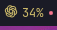
</p>

<p align="center">
  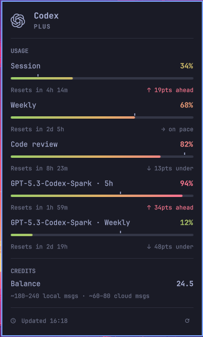
</p>

Install the plugin. Then add the plugin to your bar:

### Install the plugin

From the marketplace, or from this repository directly:

```bash
omarchy plugin add https://github.com/mryll/codexbar.git --enable
```

That clones the repository into `~/.config/omarchy/plugins/mryll.codexbar` and
validates the manifest before it is enabled. To remove it later:
`omarchy plugin remove mryll.codexbar`.

The plugin runs the `codexbar` CLI from your PATH, so install that too — from the AUR (`yay -S codexbar`) or with `make install PREFIX=~/.local`.

For development, link the working copy instead of cloning a second one:

```bash
make install PREFIX=~/.local   # if codexbar is not installed yet
make install-omarchy
```

`make install-omarchy` makes a link from the repository to `~/.config/omarchy/plugins/mryll.codexbar`. The manifest is in the root of the repository, and it points to the QML in `omarchy/`.

Then put the widget in your bar, in `~/.config/omarchy/shell.json`:

```json
{ "id": "mryll.codexbar" }
```

Mouse actions: **left click** opens the panel, **middle click** gets new data, and **right click** opens the Codex usage page. The footer of the panel ends with a refresh control (󰑐), next to the time of the last update. The control stays disabled while a fetch runs.

The plugin also answers the shell's IPC, so a keybind or a script can drive it without the mouse:

```bash
qs ipc call mryll.codexbar toggle    # open or close the panel
qs ipc call mryll.codexbar refresh   # fetch now, without opening anything
```

### Settings

You can change these keys in the settings of the shell.

| Key | Type | Default | What it does |
|---|---|---|---|
| `refreshIntervalSec` | integer | `60` | How often the widget asks for new data |
| `showLabel` | boolean | `true` | Shows the percentage after the icon. A vertical bar always shows only the icon |
| `barWindow` | enum | `Session` | Which window the bar shows: `Session`, `Weekly`, `Review`, or `Worst` (the fullest one) |
| `colorMode` | enum | `full` | `full`, `none`, `bar-only` (color on the bar only), or `panel-only` (color in the panel only) |

### The alarm dot

The bar shows one window, but Codex has more than one limit, and each limit can stop your work. If a window that you do not see is at 90% or more, a small dot appears after the percentage. There is no dot, and no message, when all of the other windows are below 90%.

Put the pointer on the widget to see which limit caused the dot, for example `Weekly: 100%`.

> [!TIP]
> To make the bar show the fullest window at all times, you can set `barWindow` to `Worst`.

> [!IMPORTANT]
> After you change a file in `omarchy/`, you must run `omarchy restart shell`. The shell does not read the QML again after `rescanPlugins`, and the shell does not monitor a directory that is a link.

## Theming

codexbar reads the colors from these sources, in sequence, and it stops at the first source that it finds:

1. The `--color-*` flags
2. The Omarchy theme, at `$XDG_STATE_HOME/omarchy/current/theme/colors.toml` (or `~/.config/omarchy/current/theme/colors.toml`, for an old installation)
3. The pywal cache, at `$XDG_CACHE_HOME/wal/colors.json`
4. The One Dark colors that are in the script

The Waybar tooltip follows the same theme:

| Flexoki Light | Rosé Pine | Hackerman |
|:---:|:---:|:---:|
| 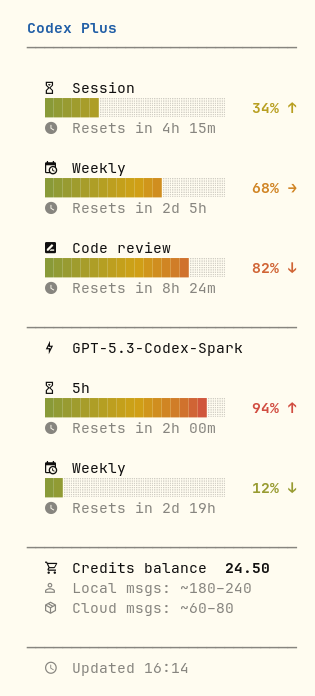 | 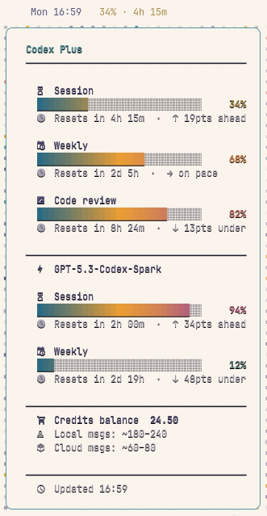 | 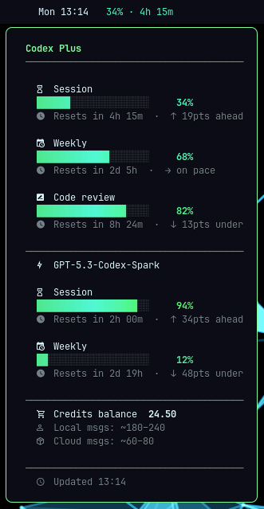 |

| Ristretto | Nord | Kanagawa |
|:---:|:---:|:---:|
| 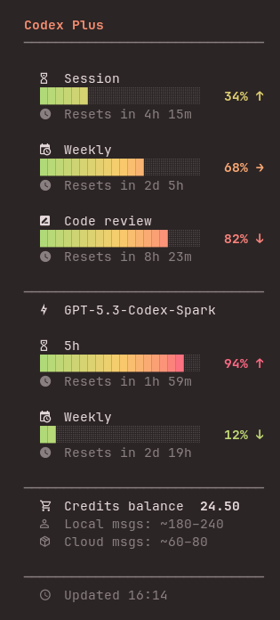 | 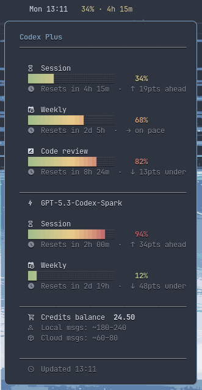 | 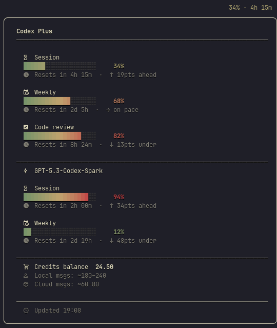 |

And so does the Omarchy panel:

| Flexoki Light | Rosé Pine | Hackerman |
|:---:|:---:|:---:|
| 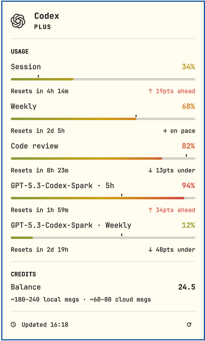 | 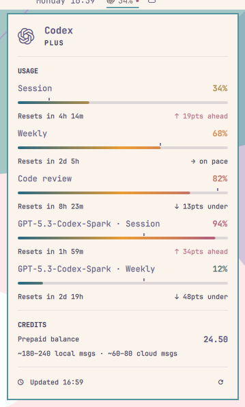 | 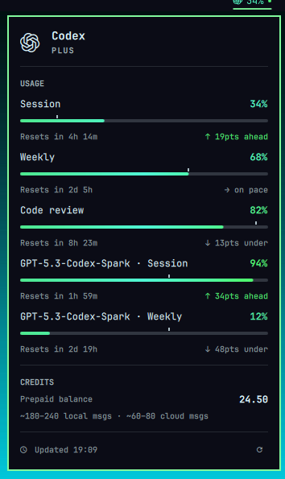 |

| Ristretto | Nord | Kanagawa |
|:---:|:---:|:---:|
| 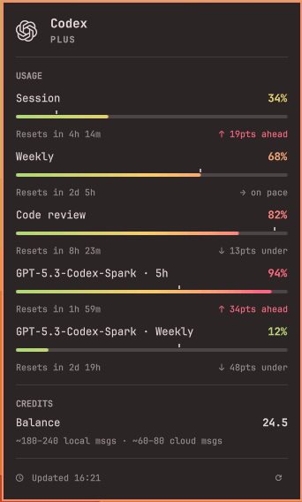 | 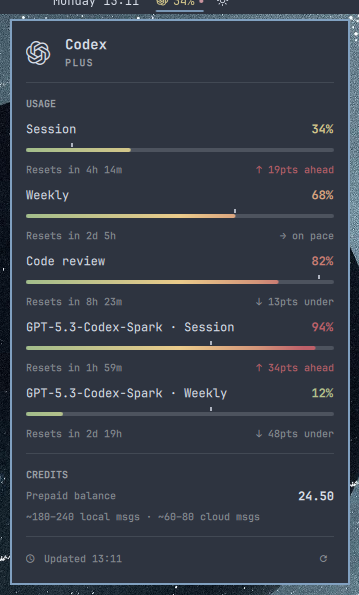 | 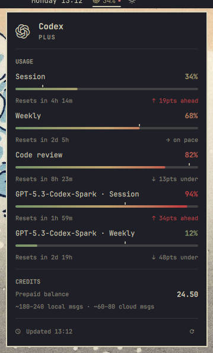 |

A theme can give its colors these names (`green`, `yellow`, `orange`, `red`), or it can use the old names (`color1`, `color2`, `color3`). codexbar prefers the names, because the names show a difference between red and orange, and the gauge needs the two colors. codexbar ignores a color that is not valid, and that color keeps its default value.

The pywal step also works with [pywal16](https://github.com/eylles/pywal16) and with the pywal target of [wallust](https://codeberg.org/explosion-mental/wallust), because these tools write the same file. pywal has no orange, so codexbar makes an orange color between the yellow and the red.

> [!NOTE]
> **If you used codexbar before August 2026, your colors will change.** The widget read the theme from the old path, and it accepted only the `color1` type of name. On a current Omarchy, the widget found no theme, so it used the colors in the script. This version corrects the two problems, so the widget now follows your real theme. If you prefer the old colors, you can set those colors with the `--color-*` flags.

> [!NOTE]
> The `--color-*` flags now accept a hex color (`#RGB`, `#RRGGBB`) or a one-word color name (`tomato`). codexbar refuses a value that contains a quotation mark, a bracket, or a space. Such a value can break the markup of the bar. codexbar also refuses a name of more than one word, for example `light blue`. You must use the hex value of the color.

## Tooltip font

The tooltip is pinned to a monospace font. That is not decoration: its rules are box-drawing characters, and in a proportional font one of those is nearly twice as wide as a letter. The tooltip then sizes itself to the rules, and a dead margin opens to the right of the text. Waybar draws the tooltip in a GTK window that ignores `font-family` from your CSS, so the markup is the only place this can be said.

The default is a **list** of families, tried in order:

```
JetBrainsMono Nerd Font Mono, JetBrainsMono Nerd Font, monospace
```

Pango falls through to the next name when one is not installed. This matters: the Arch package `ttf-jetbrains-mono-nerd` does **not** ship the `…Mono` family, so pinning that one name alone used to fall back to your system's proportional font without saying so.

To use a different font, name any monospace family (or your own list):

```bash
codexbar --tooltip-font "FiraCode Nerd Font Mono"
```

> [!NOTE]
> **`--frame` and `--frame-font` are deprecated.** `--frame` drew the tooltip as a bordered card. It is still accepted, so an existing Waybar config keeps working, but it now does nothing; `--frame-font` is an alias for `--tooltip-font`.
>
> The box was a second way of drawing the same content — more code, more documentation, more screenshots — and it only lined up when the pinned font was a complete Mono Nerd Font. Pinning the font on the one remaining tooltip gives the alignment without the box.

## Monochrome mode

`--no-color[=WHAT]` removes the color. `WHAT` is `all` (the default), `bar`, or `tooltip`.

| Command | Bar | Tooltip |
|---|---|---|
| *(nothing)* | color | color |
| `--no-color` or `--no-color=all` | plain | plain |
| `--no-color=bar` | plain | color |
| `--no-color=tooltip` | color | plain |

<p align="center">
  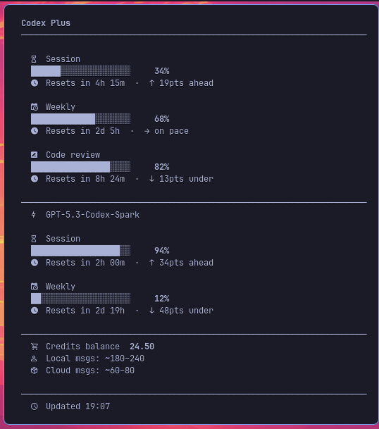
  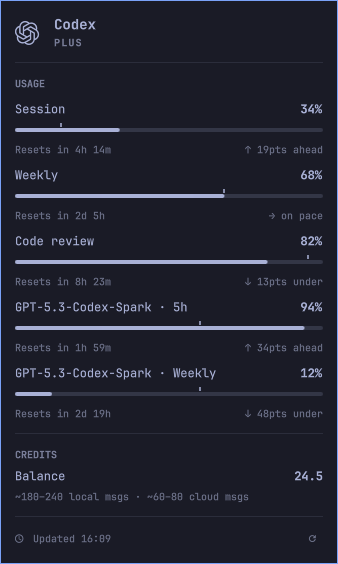
</p>

codexbar removes only the color. The icons, the bars, the pace marks, the box, and the bold text stay.

codexbar also obeys [`NO_COLOR`](https://no-color.org): any value that is not empty works like `--no-color=all`. A flag on the command line is more exact than the variable, so the flag has priority. `NO_COLOR=1 codexbar --no-color=bar` still gives you a tooltip with color.

In the Omarchy plugin, the `colorMode` setting does the same.

### Use your own colors

The CSS classes stay in monochrome mode. Remove the colors of codexbar. Then give your bar the colors that you want:

```jsonc
"exec": "codexbar --no-color"
```

```css
#custom-codexbar.low      { color: #98c379; }
#custom-codexbar.mid      { color: #e5c07b; }
#custom-codexbar.high     { color: #d19a66; }
#custom-codexbar.critical { color: #e06c75; }
```

## Structured JSON output

`codexbar --json` prints one JSON object with the data and no markup. Use this output for your own bar, your own script, or a status page. The command always exits with 0, and it always prints valid JSON, also after an error.

```bash
codexbar --json | jq
codexbar --json --refresh   # force a fresh API fetch
```

| Field | Contains |
|---|---|
| `schema_version` | The version of this format. It is `2` |
| `error` | `null`, or an object with a `message` when there is no document at all |
| `loading` | `true` while there is no data yet |
| `plan` | The plan name |
| `state` | The state of the fullest window: `low`, `mid`, `high`, or `critical` |
| `max_pct` | The percentage of that fullest window |
| `windows` | One entry for each limit. See below |
| `credits` | `has_credits`, `unlimited`, `balance`, and the approximate number of messages |
| `palette` | The colors of the gauge, and the `stops` that give the ramp |
| `stale` | `true` when the data is not new |
| `stale_reason` | `network` or `error` |
| `updated_at` | The time of the data, in ISO 8601 |
| `data_age_seconds` | The age of the data, in seconds |
| `last_error` | The last error from the API, with `http_status` and `message` |

Each entry in `windows` has: `id`, `label`, `group` (the meter it belongs to, for a per-model limit), `used_pct`, `remaining_pct`, `reset_at`, `reset_at_unix`, `window_seconds`, `elapsed_pct`, `state`, and a `pace` object.

The `pace` object has `delta_points` (your use minus the elapsed time, in percentage points), `state` (`under`, `on_pace`, `ahead`, or `hot`), `icon` and `indicator` (the arrow), `ratio_label` and `points_label` (the text that the tooltip prints).

`palette.stops` is the gauge itself: the colors, and the percentage where each color is. The value is a list of `{pct, color}`, from 0 to 100. A frontend reads the list and mixes the colors between the stops, so it does not need to know the limits. If you move a limit in the script, the bar, the tooltip, the `state` field, and the panel change together.

> [!IMPORTANT]
> `schema_version` went from `1` to `2`, and version 2 breaks version 1. The reason: codexbar and claudebar now print the same document, so one script reads both. What changed: `pace.state` has four values, not three — `on_track` became `on_pace`, and a delta of +10 points or more is now `hot`; `pace` gained `icon` and `indicator`, the arrow that the tooltip prints; the document gained `max_pct`, the percentage of the fullest window.

> [!NOTE]
> The script always exits with code 0, in JSON mode also. Waybar hides a module that exits with an error, so a problem is data in the `error` field, not an exit code.

## How it works

1. codexbar reads your tokens from `~/.codex/auth.json`, which `codex login` writes
2. codexbar gets a new token when the old token is near its end
3. codexbar asks the ChatGPT API for your use
4. codexbar keeps the answer for 60 seconds, in `~/.cache/codexbar/`
5. codexbar prints Waybar JSON — `{text, tooltip, class}` — or the structured data, with `--json`

More than one instance at the same time is safe. The instances use a lock file and make their requests in sequence. Thus many monitors make one request, and not one request for each monitor.

## Troubleshooting

| You see | It means | What to do |
|---|---|---|
| `⚠` with "No credentials" | There is no login | Run `codex login` |
| `⚠` with "Token refresh failed" | The token is not valid, or the network is down | Examine your connection. Then run `codex login` |
| `Loading…` | There is no data yet | Wait for the next request. This is normal after a start |
| `` after the text | The data is old | codexbar shows the last data that it has. codexbar tries again automatically |
| No color from your theme | codexbar cannot read the theme file | Examine `$XDG_STATE_HOME/omarchy/current/theme/` for the `colors.toml` file |
| Nothing in the bar | Waybar did not load the module | Examine your Waybar configuration. Then start Waybar again |
| The panel does not change after an edit | The shell has the old QML | Run `omarchy restart shell` |

## Related

- [claudebar](https://github.com/mryll/claudebar) — Claude AI plan usage
- [logibar](https://github.com/mryll/logibar) — the battery of Logitech devices
- [meteobar](https://github.com/mryll/meteobar) — the weather, from Open-Meteo
- [printbar](https://github.com/mryll/printbar) — any printer: supplies, trays and queue
- [tickerbar](https://github.com/mryll/tickerbar) — prices of crypto, stocks, indices, commodities and forex
- [Omarchy](https://github.com/basecamp/omarchy) — the Linux setup for these widgets
- [Waybar](https://github.com/Alexays/Waybar) — the status bar for Wayland
